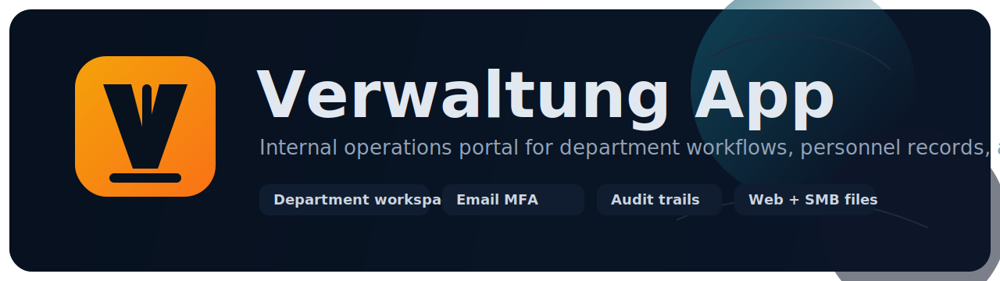
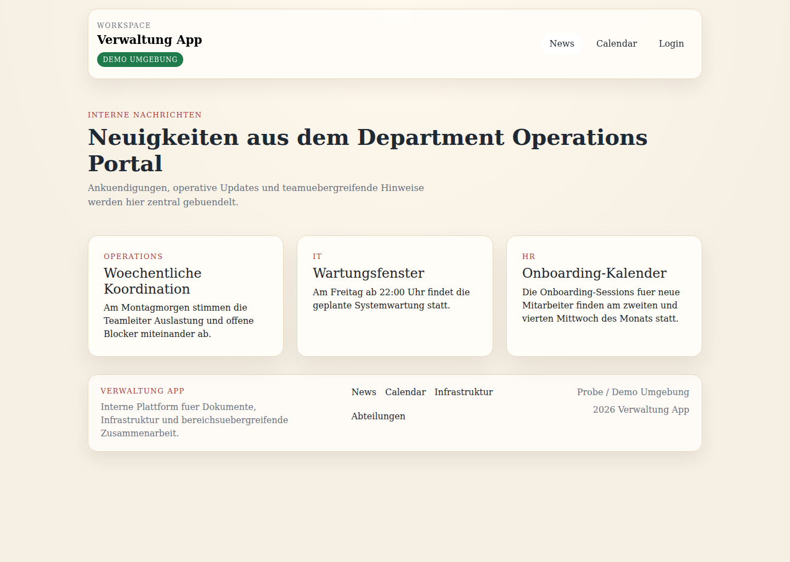
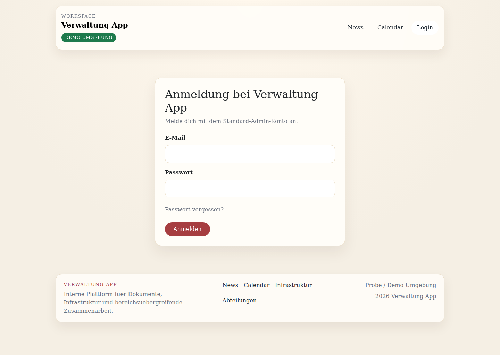
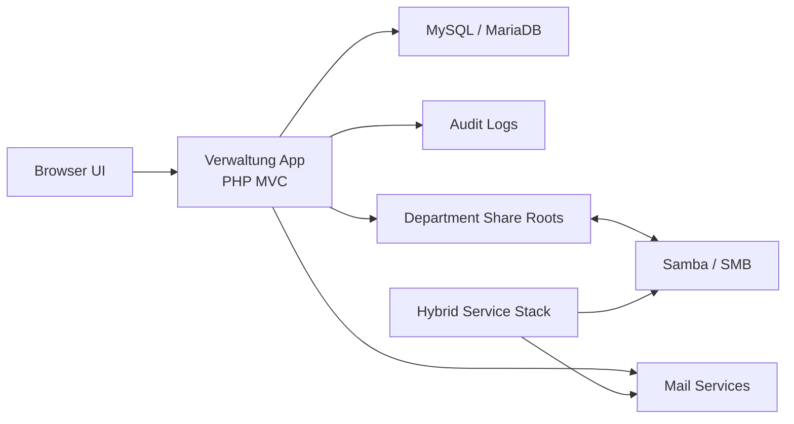

<p align="center">
  
</p>

<p align="center">
  <strong>Internal operations portal for department workspaces, personnel workflows, audit visibility, and hybrid document access.</strong>
</p>

<p align="center">
  <a href="#quick-start">Quick Start</a>
  ·
  <a href="#preview">Preview</a>
  ·
  <a href="#platform-snapshot">Platform Snapshot</a>
  ·
  <a href="#architecture">Architecture</a>
  ·
  <a href="#security-model">Security</a>
  ·
  <a href="#testing--ci">Testing</a>
  ·
  <a href="infra/README.md">Infrastructure</a>
</p>

<p align="center">
  
  
  
  
  
  
  
</p>

<p align="center">
  <a href="#quick-start">
    
  </a>
  <a href="infra/README.md">
    
  </a>
  <a href="#weekly-audit-report-automation">
    
  </a>
  <a href="_docs/20-rollout-sequence.md">
    
  </a>
</p>

## Platform Snapshot

Verwaltung App is a PHP 8.2 server-rendered business application for internal company operations. It keeps workflow logic, authorization boundaries, personnel handling, and hybrid file access explicit instead of hiding them behind generic admin CRUD.

| Area | Included |
| --- | --- |
| Department workspaces | Dashboard, department pages, shortcuts, summary stats, role-based visibility |
| Operations | Tasks, internal mail, calendar flows, audit dashboard, CSV exports |
| Personnel | IT-first user provisioning, HR-managed profiles, retention metadata, personnel documents |
| Security | Session auth, email challenge MFA for privileged roles, login throttling, password reset throttling |
| Hybrid access | Browser file access inside the app plus Samba/SMB share access to the same structure |
| Automation | Database runner, weekly audit report CLI, systemd/cron renderers, GitHub Actions CI |

## Preview

<table>
  <tr>
    <td width="50%">
      
    </td>
    <td width="50%">
      
    </td>
  </tr>
  <tr>
    <td><strong>Public news / landing screen</strong></td>
    <td><strong>Login screen</strong></td>
  </tr>
</table>

The screenshots above were captured from the local demo environment. A matching social preview asset is available at `.github/assets/social-preview.png`.

## Primary Modules

| Route | Purpose |
| --- | --- |
| `/dashboard` | Department-centric start page with shortcuts and summary statistics |
| `/departments` | Visible department list for the current user |
| `/departments/{slug}` | Department workspace with documents, uploads, and department-specific actions |
| `/services` | Infrastructure overview with live mail and file health indicators |
| `/services/fileserver` | Web file browser for department shares |
| `/mail` | Internal mail interface |
| `/calendar` | Shared calendar and reminders |
| `/audit` | Central audit dashboard and export entrypoint |

## Core Workflows

### IT-first personnel provisioning

IT creates the technical account first with name, email, target department, role, and a temporary password. On first login, the user must rotate the password under server-side password rules.

### HR-first data is intentionally disallowed

HR does not create arbitrary people directly. HR creates the personnel profile only for a user already provisioned by IT, preserving a clearer separation between technical identity and personnel-sensitive data.

### Hybrid file access

Department files are reachable through two access paths:

1. The in-app browser at `/services/fileserver`
2. Samba/SMB share access for Explorer, Finder, and external editing workflows

Both paths point to the same department share structure.

## Architecture



## Quick Start

### 1. Create `.env`

Use or update a local `.env` with at least:

```env
APP_NAME="Verwaltung App"
APP_ENV=local
APP_DEBUG=true
APP_DEMO_MODE=true

DB_CONNECTION=mysql
DB_HOST=127.0.0.1
DB_PORT=3306
DB_DATABASE=verwaltung_app
DB_USERNAME=root
DB_PASSWORD=your_password
```

### 2. Prepare the database

```bash
php bin/setup-database.php
```

Useful variants:

```bash
php bin/setup-database.php --dry-run
php bin/setup-database.php --migrate-only
php bin/setup-database.php --seed-only
APP_ENV=testing php bin/setup-database.php --fresh
```

The setup runner creates the configured database if needed, applies pending SQL migrations once, and applies pending seed files once. If the database already exists from manual setup, the runner adopts that state into its tracking tables instead of replaying old files.

### 3. Serve the app

Expose the project through your local PHP or web-server setup so the app is reachable on a local domain such as:

- `http://verwaltung_app.test`

### 4. Run the test suite

```bash
APP_ENV=testing php bin/setup-database.php --fresh
php tests/run.php
```

## Development Commands

```bash
# Database lifecycle
php bin/setup-database.php
php bin/setup-database.php --dry-run
APP_ENV=testing php bin/setup-database.php --fresh

# Tests
php tests/run.php

# Weekly audit report
php bin/send-weekly-audit-report.php --dry-run
infra/scripts/send-weekly-audit-report.sh

# Hybrid services
infra/scripts/start-hybrid-services.sh demo
infra/scripts/start-hybrid-services.sh internal
infra/scripts/stop-hybrid-services.sh demo
infra/scripts/stop-hybrid-services.sh internal
```

## Infra and Hybrid File Access

Use the wrapper scripts instead of trying to launch every `.yml` file manually.

Start demo stack:

```bash
infra/scripts/start-hybrid-services.sh demo
```

Start internal stack:

```bash
infra/scripts/start-hybrid-services.sh internal
```

Stop demo stack:

```bash
infra/scripts/stop-hybrid-services.sh demo
```

Stop internal stack:

```bash
infra/scripts/stop-hybrid-services.sh internal
```

Why not “run all yml files”:

- not every `.yml` file in the repository is a Docker Compose file
- files such as `infra/file/config.yml` are operational service configuration
- the wrapper scripts choose the correct compose files and keep startup predictable

Samba / SMB notes:

- demo Samba is exposed on `localhost:1445`
- this is an SMB service port, not an HTTP endpoint
- `infra/file/config.yml` is local operational config
- `infra/file/config.yml.example` is the committed template
- app credentials and Samba credentials are intentionally separate, but should follow the same department role model

Recommended role mapping:

- IT: `teamlead-it`, `employee-it`
- HR: `teamlead-hr`, `employee-hr`
- Operations: `teamlead-operations`, `employee-operations`

Additional deployment notes are in [infra/README.md](infra/README.md).

## Security Model

The project follows these rules:

- authenticate every protected action
- authorize on the server side
- deny by default when access is incomplete
- throttle repeated login failures on the server side
- require an emailed second-step code for configured privileged logins
- throttle repeated admin login challenge failures on the server side
- use expiring single-use password reset links for guest recovery
- throttle repeated forgot-password requests on the server side
- require first-login password rotation for provisioned users
- separate technical account provisioning from HR-sensitive personnel processing
- keep department-sensitive and personnel-sensitive files on explicit access paths
- audit personnel-document access in a dedicated log stream

## Testing & CI

The repository ships with a lightweight PHP test harness for fast local verification.

Current automated coverage includes:

- authentication, MFA, throttling, and password rotation
- IT-managed user provisioning validation
- HR personnel profile and document flows
- audit logging, dashboard, mail, calendar, and task workflows
- database-backed feature coverage for critical permissions and transitions

Run locally:

```bash
php tests/run.php
```

Reset a clean test database first when you want a fresh baseline:

```bash
APP_ENV=testing php bin/setup-database.php --fresh
php tests/run.php
```

GitHub Actions runs the same `php tests/run.php` suite on every push and pull request after a fresh `php bin/setup-database.php --fresh`.

## Project Layout

```text
app/                  Controllers, services, models, core classes
bin/                  CLI entrypoints for operational tasks
bootstrap/            Bootstrap and environment loading
config/               App, auth, database, filesystem configuration
database/
  migrations/         Ordered SQL migrations
  seeds/              Ordered SQL seed files
infra/
  demo/               Demo compose stack
  file/               Samba config and share roots
  scripts/            Operational helper scripts
public/               Front controller and public assets
resources/views/      Server-rendered PHP views
routes/               Route definitions
tests/                Lightweight automated test suite and harness
_docs/                Change documentation and verification notes
.claude/              Workspace guidance for disciplined development
```

## Documentation Workflow

Project changes are tracked in `_docs/` using paired implementation and verification notes. For meaningful changes, the repo keeps:

- implementation intent
- verification evidence
- operational notes

## Operational Notes

- personnel-document audit entries are written to `storage/logs/personnel-document-access.log`
- `/services` evaluates live infrastructure health and may show `Healthy`, `Degraded`, or `Down`
- HR document handling supports create, open, download, delete, and employee-profile maintenance from the department workspace
- weekly audit report automation is available through both the dashboard and CLI tooling

## Weekly Audit Report Automation

Manual dashboard sending remains available from `/audit`, but unattended delivery should use the CLI entrypoint.

Dry run:

```bash
php bin/send-weekly-audit-report.php --dry-run
```

Cron-friendly wrapper:

```bash
infra/scripts/send-weekly-audit-report.sh
```

Render systemd assets:

```bash
infra/scripts/render-weekly-audit-report-systemd.sh /tmp/systemd
```

Render systemd assets with an explicit host PHP binary:

```bash
infra/scripts/render-weekly-audit-report-systemd.sh /tmp/systemd www-data www-data admin@verwaltung.local "Mon *-*-* 07:00:00" /usr/bin/php8.2
```

Render `/etc/cron.d` style asset:

```bash
infra/scripts/render-weekly-audit-report-cron.sh /tmp/verwaltung-weekly-audit-report
```

Render a cron asset with an explicit host PHP binary:

```bash
infra/scripts/render-weekly-audit-report-cron.sh /tmp/verwaltung-weekly-audit-report root admin@verwaltung.local "0 7 * * 1" /var/log/verwaltung-weekly-audit-report.log /usr/bin/php8.2
```

Install systemd assets directly into a target directory:

```bash
sudo infra/scripts/install-weekly-audit-report-systemd.sh /etc/systemd/system www-data www-data admin@verwaltung.local "Mon *-*-* 07:00:00" /usr/bin/php8.2
```

Install a cron asset directly into a target path:

```bash
sudo infra/scripts/install-weekly-audit-report-cron.sh /etc/cron.d/verwaltung-weekly-audit-report root admin@verwaltung.local "0 7 * * 1" /var/log/verwaltung-weekly-audit-report.log /usr/bin/php8.2
```

Example cron entry:

```cron
PHP_BIN=/usr/bin/php8.2
0 7 * * 1 cd /path/to/verwaltung_app && /usr/bin/env bash infra/scripts/send-weekly-audit-report.sh >> /var/log/verwaltung-audit-report.log 2>&1
```

Suggested host install flow:

1. Either render assets for review or install them directly with the helper scripts.
2. If the host should not resolve plain `php`, pass a final `PHP_BIN` argument such as `/usr/bin/php8.2`.
3. If you used the render-only flow, copy the rendered file into `/etc/systemd/system/` or `/etc/cron.d/`.
4. For systemd, run `systemctl daemon-reload` and `systemctl enable --now verwaltung-weekly-audit-report.timer`.
